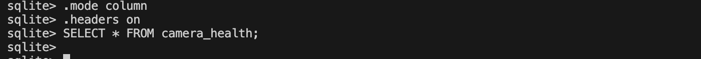
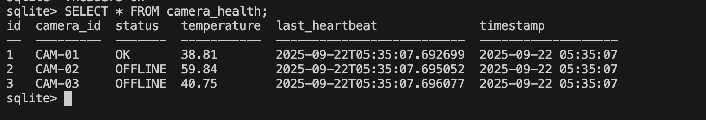

# Task: Integrate Health Data Problem

**Overview**  
A simple backend service that periodically fetches camera health data and stores it in a local SQLite database. The project demonstrates:

- a FastAPI web server with endpoints to trigger and view health fetches,  
- an in-app scheduler 
- a small SQLite DB that persists health snapshots.  

> **Note:** This project uses **dummy (simulated) camera data** in `health_fetcher.py`. Replace that logic with real camera API calls to use with real devices.
 

##  Features
- FastAPI backend (HTTP API)  
- SQLite database for storing camera health history  
- Background scheduler
- Manual trigger endpoint to fetch health (`/health/fetch`)   

## Project Structure

```plaintext
Task6/
├── app.py              
├── scheduler.py    
├── db.py               
├── health_fetcher.py  
├── requirements.txt   
└── camera_health.db   

```

## Prerequisites
- Python 3.8+  
- (Optional) virtualenv / venv


##  Installation & Run 
1. Create & activate virtual environment (optional):

2. Install dependencies:
```bash
pip install -r requirements.txt
```

3. Start the FastAPI app 
```bash
uvicorn app:app --reload
```

## Inspecting the SQLite Database

1. Open DB:
```bash
sqlite3 camera_health.db
```

2. View rows in camera_health:

```bash
.mode column
.headers on
SELECT * FROM camera_health;

```

## Example Usage
### 1. Before Triggering Health Data Fetch


### 2. After Fetching Health Data



### Replacing Dummy Data with Real Camera Calls

To use real camera endpoints instead of simulated data, update the `health_fetcher.py` file.

#### Steps:

1. Replace the simulated payload generator with real camera endpoints.

2. Fetch data from each endpoint using HTTP requests.

3. Parse the responses and insert the data into the database.
