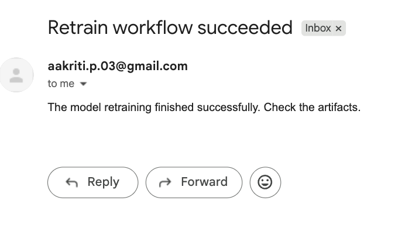

# Bandwidth Adaptive Streaming – Automated Retraining Pipeline

This project demonstrates how to **train and automatically retrain a machine learning model** for **bandwidth prediction** using the [Adaptive Bandwidth Prediction Dataset](https://www.kaggle.com/datasets/programmer3/adaptive-bandwidth-prediction-dataset).

The pipeline is automated with **GitHub Actions**, includes multiple **trigger conditions**, and sends **email notifications** after each run.
 
## Features
- Trains a machine learning model to **predict bandwidth values** from network features.
- Automatically **re-trains the model** when triggers are met.
- Supports **multiple model types** (Random Forest, XGBoost).
- **Email notifications** for success/failure of retraining pipeline.
- Dockerized for portability and easy deployment.
 

##  Triggers for Retraining
The retraining workflow runs when:
1. A new version of the dataset CSV file is committed.
2. Code is pushed to the `main` branch.
3. Scheduled run every day at **02:00 UTC**.
4. Manual trigger via **workflow_dispatch** (GitHub Actions "Run workflow" button).


#  Project Structure

```
task8/
├── data/                    
├── models/                  
├── src/
│   ├── utils.py               
│   ├── train.py              
│   ├── retrain_monitor.py    
├── Dockerfile
├── requirements.txt
├── .github/
│   └── workflows/retrain.yml  
├── README.md
```


# requirements.txt

```txt
pandas
numpy
scikit-learn
xgboost
joblib
requests
python-dotenv
boto3
```
 
 

#  Notifications

Notification is implemented via email. Emails are sent on Sucees and Failure of retraining pipeline

Configured securely using GitHub Secrets:
- EMAIL_USERNAME → your email address (SMTP enabled).
- EMAIL_PASSWORD → app password or SMTP token.
 


# How to Run  

### 1. Local training

```bash 
pip install -r requirements.txt
# train
python -m src.train --model-type xgb
```

### 2. Trigger monitor locally
```bash
python -m src.retrain_monitor
```

### 3. CI/CD pipeline (GitHub Actions)

The workflow (.github/workflows/retrain.yml) will:

1. Install dependencies.

2. Retrain the model when triggers occur.

3. Save model artifacts.

4. Send email notification with the status.
 

### Example Email (Success) 

